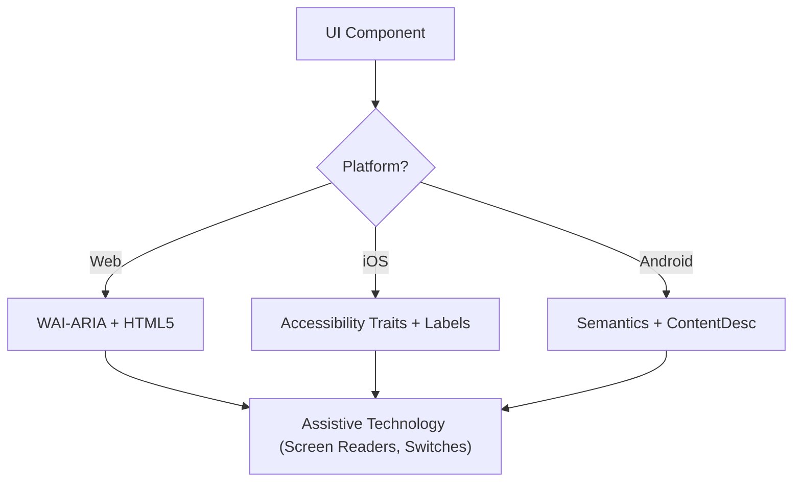

# 无障碍（WCAG 2.2）

本技能确保数字界面对所有用户都是可感知的、可操作的、可理解的和健壮的（POUR），包括使用屏幕阅读器、开关控制或键盘导航的用户。它侧重于 WCAG 2.2 成功标准的技术实现。

## 何时使用

- 为 Web、iOS 或 Android 定义 UI 组件规范。
- 审计现有代码的无障碍障碍或合规差距。
- 实现新的 WCAG 2.2 标准，如目标尺寸（最小值）和焦点外观。
- 将高层设计需求映射到技术属性（ARIA 角色、特征、提示）。

## 核心概念

- **POUR 原则**：WCAG 的基础（可感知的、可操作的、可理解的、健壮的）。
- **语义映射**：使用原生元素而非通用容器，以提供内置无障碍支持。
- **无障碍树**：辅助技术实际"读取"的 UI 表示。
- **焦点管理**：控制键盘/屏幕阅读器光标的顺序和可见性。
- **标签与提示**：通过 `aria-label`、`accessibilityLabel` 和 `contentDescription` 提供上下文。

## 工作原理

### 步骤 1：确定组件角色

确定功能目的（例如，这是一个按钮、一个链接还是一个选项卡？）。在使用自定义角色之前，优先使用最语义化的原生元素。

### 步骤 2：定义可感知属性

- 确保文本对比度满足 **4.5:1**（正常文本）或 **3:1**（大文本/UI 组件）。
- 为非文本内容（图像、图标）添加文本替代。
- 实现响应式重排（支持高达 400% 缩放而不丢失功能）。

### 步骤 3：实现可操作控件

- 确保最小 **24x24 CSS 像素**的目标尺寸（WCAG 2.2 SC 2.5.8）。
- 验证所有交互元素可通过键盘访问，并具有可见的焦点指示器（SC 2.4.11）。
- 为拖拽操作提供单指针替代方案。

### 步骤 4：确保可理解的逻辑

- 使用一致的导航模式。
- 提供描述性错误消息和纠正建议（SC 3.3.3）。
- 实现"冗余输入"（SC 3.3.7），防止重复要求相同数据。

### 步骤 5：验证健壮兼容性

- 使用正确的 `名称、角色、值` 模式。
- 为动态状态更新实现 `aria-live` 或实时区域。

## 无障碍架构图



## 跨平台映射

| 功能               | Web (HTML/ARIA)           | iOS (SwiftUI)                         | Android (Compose)                                           |
| :----------------- | :------------------------ | :------------------------------------ | :---------------------------------------------------------- |
| **主要标签**       | `aria-label` / `<label>`  | `.accessibilityLabel()`               | `contentDescription`                                        |
| **次要提示**       | `aria-describedby`        | `.accessibilityHint()`                | `Modifier.semantics { stateDescription = ... }`             |
| **操作角色**       | `role="button"`           | `.accessibilityAddTraits(.isButton)`  | `Modifier.semantics { role = Role.Button }`                 |
| **实时更新**       | `aria-live="polite"`      | `.accessibilityLiveRegion(.polite)`   | `Modifier.semantics { liveRegion = LiveRegionMode.Polite }` |

## 示例

### Web：无障碍搜索

```html
<form role="search">
  <label for="search-input" class="sr-only">搜索产品</label>
  <input type="search" id="search-input" placeholder="搜索..." />
  <button type="submit" aria-label="提交搜索">
    <svg aria-hidden="true">...</svg>
  </button>
</form>
```

### iOS：无障碍操作按钮

```swift
Button(action: deleteItem) {
    Image(systemName: "trash")
}
.accessibilityLabel("删除项目")
.accessibilityHint("永久从列表中移除此项目")
.accessibilityAddTraits(.isButton)
```

### Android：无障碍切换控件

```kotlin
Switch(
    checked = isEnabled,
    onCheckedChange = { onToggle() },
    modifier = Modifier.semantics {
        contentDescription = "启用通知"
    }
)
```

## 需要避免的反模式

- **Div 按钮**：使用 `<div>` 或 `<span>` 处理点击事件，而不添加角色和键盘支持。
- **仅颜色传达含义**：仅通过颜色变化来指示错误或状态（例如，将边框变红）。
- **未限制的模态框焦点**：模态框不捕获焦点，允许键盘用户在模态框打开时导航到背景内容。焦点必须被限制，并且可通过 `Escape` 键或显式关闭按钮退出（WCAG SC 2.1.2）。
- **冗余替代文本**：在替代文本中使用"图片..."或"图像..."（屏幕阅读器已经会播报"图像"角色）。

## 最佳实践检查清单

- [ ] 交互元素满足 **24x24px**（Web）或 **44x44pt**（原生）的目标尺寸。
- [ ] 焦点指示器清晰可见且高对比度。
- [ ] 模态框在打开时**包含焦点**，关闭时干净地释放焦点（`Escape` 键或关闭按钮）。
- [ ] 下拉菜单和菜单在关闭时将焦点恢复到触发元素。
- [ ] 表单提供基于文本的错误建议。
- [ ] 所有仅图标按钮都有描述性文本标签。
- [ ] 文本缩放时内容正确重排。

## 参考资料

- [WCAG 2.2 指南](https://www.w3.org/TR/WCAG22/)
- [WAI-ARIA 创作实践](https://www.w3.org/TR/wai-aria-practices/)
- [iOS 无障碍编程指南](https://developer.apple.com/documentation/accessibility)
- [iOS 人机界面指南 - 无障碍](https://developer.apple.com/design/human-interface-guidelines/accessibility)
- [Android 无障碍开发者指南](https://developer.android.com/guide/topics/ui/accessibility)

## 相关技能

- `frontend-patterns`
- `design-system`
- `liquid-glass-design`
- `swiftui-patterns`
